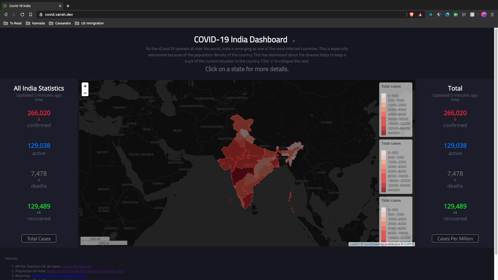

# Covid19 India Dashboard

This is a dashboard that analyzes the situation of Coronavirus in India made in React using Leaflet(react-leaflet) and deployed on Netlify. It uses the covid19india api from https://www.covid19india.org/.

## Project Goals
- To make a smart dashboard that keeps a track of the current situation of nCovid-19 in India in order to provide a context to the people and policymakers.
- To use skills learnt in GEOG458 and evaluate if I can make such a solution or not.
- Although the lockdown in India is almost over, I want to use this dashboard for people to see that the situation is still spreading and they should take precautions in their daily lives.

## Data Sources
1. API for Statistics for all states: [Covid 19 India API](https://github.com/covid19india/api)
2. Population of India: [Government of India Population Projection 2019](https://nhm.gov.in/New_Updates_2018/Report_Population_Projection_2019.pdf)
3. Basemap: [CartoDB Dark Basemap with labels](http://www.basemaps.cartocdn.com/rastertiles/dark_all/%7Bz%7D/%7Bx%7D/%7By%7D.png)
4. India State Shapefiles: [Subhash9325/GeoJson-Data-of-Indian-States](https://github.com/Subhash9325/GeoJson-Data-of-Indian-States)

## Major Libraries used
1. [react-leaflet](https://react-leaflet.js.org/)
2. [netlify](https://www.netlify.com/)
3. [react](https://reactjs.org/)
4. [moment](https://momentjs.com/)

## Acknowledgment
 - Professor Jakob Zhao: GEOG 458, UW - Spring 2020 (https://github.com/jakobzhao/)

## React Scripts:

This project was bootstrapped with [Create React App](https://github.com/facebook/create-react-app).

## Available Scripts

In the project directory, you can run:

### `yarn start`

Runs the app in the development mode. 
Open [http://localhost:3000](http://localhost:3000) to view it in the browser.

The page will reload if you make edits. 
You will also see any lint errors in the console.

### `yarn test`

Launches the test runner in the interactive watch mode. 
See the section about [running tests](https://facebook.github.io/create-react-app/docs/running-tests) for more information.

### `yarn build`

Builds the app for production to the `build` folder. 
It correctly bundles React in production mode and optimizes the build for the best performance.

The build is minified and the filenames include the hashes. 
Your app is ready to be deployed!

See the section about [deployment](https://facebook.github.io/create-react-app/docs/deployment) for more information.

## Learn More

You can learn more in the [Create React App documentation](https://facebook.github.io/create-react-app/docs/getting-started).
